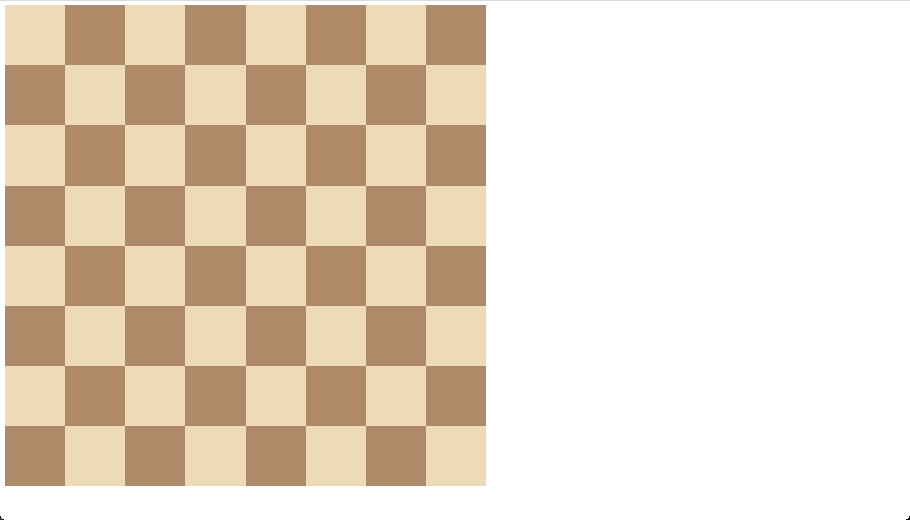

# Chess Grid 🎮

A beginner-friendly demonstration project showcasing the power of CSS Grid through the creation of a classic chessboard layout. Perfect for learning modern CSS layout techniques!

## 🎯 Project Overview

This project implements a responsive chessboard using CSS Grid, demonstrating:
- Efficient grid layout implementation
- CSS color styling
- Responsive design principles
- Clean and maintainable HTML structure

## 🖼️ Preview



## 🛠️ Tech Stack

| Technology | Purpose |
|------------|---------|
| HTML5 | Structure and semantics |
| CSS3 | Styling and Grid layout |

## ✨ Key Features

- 8x8 grid layout using CSS Grid
- Alternating square colors
- Responsive design
- Clean, minimal implementation
- No JavaScript required

## 🚀 Quick Start

1. Clone the repository:
```bash
git clone https://github.com/Briso10-dev/Chess-Grid.git
```

2. Open `index.html` in your browser to view the chessboard.

## 💡 Implementation Details

- Uses CSS Grid with `repeat(8, 1fr)` for perfect square distribution
- Implements a clean alternating pattern using separate classes
- Responsive sizing with `rem` units
- Optimized for cross-browser compatibility

## 📝 Code Structure

```
Chess-Grid/
├── index.html      # Main HTML structure
├── style.css       # CSS styling and grid implementation
├── goal.png        # Project preview image
└── README.md       # Project documentation
```

## 👨‍💻 Author

**Seraphin Brice Kouam**
- GitHub: [@Seraphin Brice Kouam](https://github.com/Briso10-dev)

## 📚 Learning Resources

- [CSS Grid Layout - MDN](https://developer.mozilla.org/en-US/docs/Web/CSS/CSS_Grid_Layout)
- [A Complete Guide to Grid - CSS-Tricks](https://css-tricks.com/snippets/css/complete-guide-grid/)

## 🤝 Contributing

Feel free to fork this project, submit PRs, and suggest any improvements!

## 📄 License

This project is open source and available under the [MIT License](https://opensource.org/licenses/MIT).
